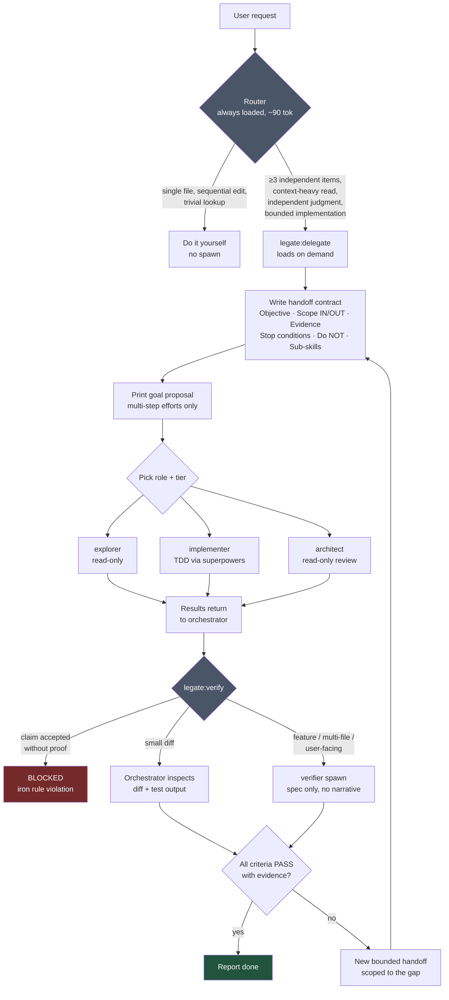
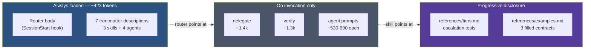
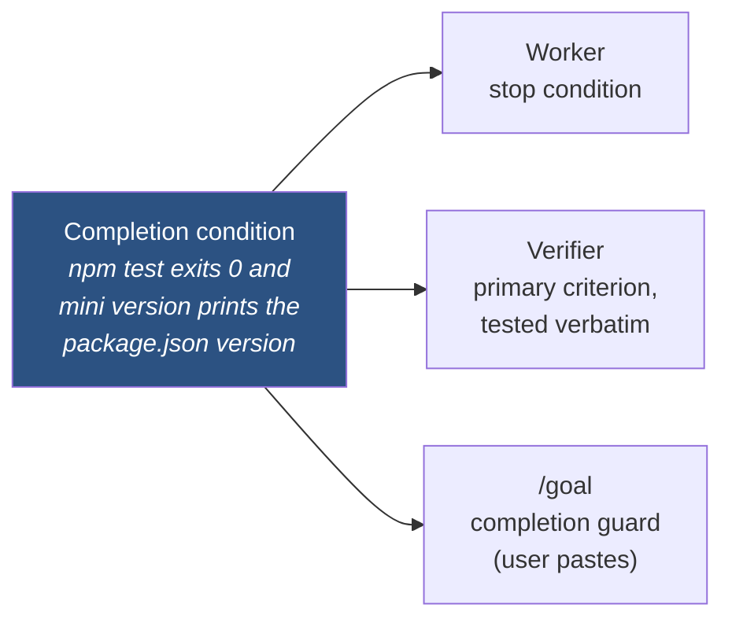

# Legate

**An orchestration layer for Claude Code that decides when to delegate, to whom, and refuses to accept "done" without evidence.**

Claude Code can spawn subagents. It has no opinion about _when_ that's worth doing, what a good handoff looks like, or whether a worker's completion claim should be believed. Legate supplies those opinions in ~423 tokens of always-on context.

It is deliberately small. Methodology — planning, TDD, debugging, code review — comes from [superpowers](https://github.com/obra/superpowers), which Legate depends on and references by name rather than restating.

> **Legate owns dispatch. Superpowers owns method.**

---

## Why this exists

Three failure modes show up constantly in agentic coding sessions:

| Failure                  | What it looks like                                                                                   | Legate's answer                                                                                     |
| ------------------------ | ---------------------------------------------------------------------------------------------------- | --------------------------------------------------------------------------------------------------- |
| **Under-delegation**     | The orchestrator burns its own context reading 40 files serially when four parallel workers would do | Router fires on ≥3 independent items and other objective triggers                                   |
| **Over-delegation**      | A subagent is spawned to run one `grep`; synthesis overhead exceeds the work                         | "Delegating a grep is a bug" — an explicit NO branch with anti-rationalization table                |
| **Trusted self-reports** | Worker says "all tests pass, task complete." It isn't, and nobody checked                            | Iron rule: a completion claim is never evidence. Inspect the diff or spawn a fresh-context verifier |

Plus a cost dimension: not every task needs a frontier model, and the expensive ones shouldn't be chosen by accident. Every role is a **tier band** with a written escalation test.

---

## How it works



### Context loading

The whole design goal is that Legate costs almost nothing until it's needed. Claude Code loads skill _descriptions_ at startup and skill _bodies_ only on invocation — Legate leans on that hard.



Verify it yourself: `claude plugin details legate`.

---

## Roles and tier bands

Every role is a band, not a fixed model. The agent frontmatter pins a default; each spawn runs that role's escalation test and passes a model override if warranted.

| Role            | Band                          | Access              | Job                                                    |
| --------------- | ----------------------------- | ------------------- | ------------------------------------------------------ |
| **explorer**    | `haiku` → `sonnet`            | read-only allowlist | search, map, summarize — conclusions, not transcripts  |
| **implementer** | `sonnet` → `opus`             | full                | one bounded task per handoff, TDD, evidence not claims |
| **architect**   | `opus` → `fable` ⚠            | no Write/Edit       | design review — verdict, ranked concerns, alternatives |
| **verifier**    | `sonnet` ← `opus` → `fable` ⚠ | no Write/Edit       | fresh-context validation, spec-only (anti-anchoring)   |

**Escalation examples.** explorer bumps to `sonnet` when the search needs inference rather than pattern-matching. implementer bumps to `opus` when the change is cross-cutting, the spec is ambiguous, the work product _is_ judgment (writing evals or rubrics rather than code against tests), or a `sonnet` attempt already failed verification — never retry the same task at the same tier.

⚠ **The `fable` step requires explicit user confirmation, every time.** It costs roughly 2× `opus` and runs minutes-long turns, so it is reserved for cases where an `opus` pass already ran and was inconclusive on an expensive-to-reverse decision. Prior approval never carries over. In-band upgrades below that never prompt — the escalation tests are the control.

Model aliases appear in exactly two places: `skills/delegate/references/tiers.md` and agent frontmatter. Nothing else in the plugin names a model, so a new tier is a two-file edit.

---

## The handoff contract

A delegated agent inherits none of your context. The spawn prompt _is_ the task. Legate requires six named sections — an empty one means the task isn't scoped yet:

```markdown
## Objective

One sentence, outcome-shaped. "Make X true", not "look into X".

## Scope

IN: exact paths / repos / globs the worker may touch
OUT: what is explicitly off-limits

## Expected evidence

Concrete artifacts: file:line refs, diff summary, failing-then-passing
test output, command + exit code. Never "a report that it works".

## Stop conditions

- Done when: <observable completion state>
- Completion condition: <one machine-checkable sentence — end state + check method>
- Max attempts: N on the same failure, then stop
- If blocked: STOP and report. Do not improvise.

## Do NOT

Commit/push, touch Scope/OUT, refactor beyond the objective,
expand into problems discovered mid-task.

## Role-specific sub-skills

REQUIRED SUB-SKILL: superpowers:test-driven-development (implementer spawns)
```

### One sentence, three consumers

The **Completion condition** line is the contract's keystone:



Before the first implementer spawn of a multi-step effort, Legate prints a ready-to-paste proposal:

```
Goal proposal (paste to arm Claude Code's completion guard):
/goal npm test exits 0 and mini version prints the package.json version
```

[`/goal`](https://code.claude.com/docs/en/goal) has no programmatic API and subagents never see it — Legate proposes, never assumes, and never blocks on it.

---

## Verification

```
A SUBAGENT'S COMPLETION CLAIM IS NEVER ACCEPTED ON ITS OWN.
```

Completion requires either the orchestrator inspecting the claimed evidence directly, or a verifier spawn confirming it. Verification scales to stakes — a one-file non-user-facing diff gets read directly; a claimed-complete feature, a multi-file change, or anything user-facing gets a verifier.

The verifier receives **only** the spec, acceptance criteria, completion condition, and repo access — never the implementer's narrative, which would anchor it onto the same blind spots. It returns PASS/FAIL per criterion with an evidence pointer; a criterion with no observable proof is a FAIL.

Failures do not go back as "please fix the above." Each becomes a **new bounded handoff** scoped to exactly that gap, then gets re-verified. When no spawn is available, a documented clean-room fallback applies: re-derive checks from the spec alone and label the result "verified same-context."

---

## Install

The repo is its own single-plugin marketplace.

```bash
claude plugin marketplace add wojciech-arch/legate
claude plugin install legate@legate --scope user
```

Legate depends on superpowers (`^6`, from the `claude-plugins-official` marketplace), which is resolved and installed automatically if missing. Restart or `/reload-plugins` to activate.

**Requires** Claude Code ≥ 2.1.196 (local-folder marketplace tag resolution). The `/goal` integration assumes ≥ 2.1.139; without it the goal proposal is simply inert text.

### Development

```bash
claude plugin marketplace add /path/to/legate
claude plugin install legate@legate --scope user
```

Installs are snapshot copies, not live links. After editing the source, re-sync:

```bash
claude plugin uninstall legate && claude plugin install legate@legate --scope user
```

`/reload-plugins` refreshes skills and agents but does **not** re-fire the SessionStart hook — start a fresh session to pick up router changes. For a GitHub-installed copy, run `claude plugin marketplace update legate` before the reinstall.

---

## Try it

In a fresh session:

```
Work on the fixture at evals/fixtures/mini-cli (copy it to /tmp first).
Map the project, then add a `version` command printing the version from
package.json. Delegate the implementation and verify it independently
before telling me it's done.
```

Expect: router announces itself → mapping done inline (3 files is below the delegation bar) → goal proposal printed → implementer spawn with a full contract → verifier spawn fed spec-only → per-criterion PASS/FAIL with command output.

---

## Repository layout

```
legate/
├── skills/
│   ├── orchestrating/SKILL.md      # router — the only always-injected body
│   ├── delegate/
│   │   ├── SKILL.md                # handoff contract template
│   │   └── references/
│   │       ├── tiers.md            # escalation tests + the only prose model names
│   │       └── examples.md         # three complete filled-in contracts
│   └── verify/SKILL.md             # verification protocol
├── agents/                         # explorer, implementer, architect, verifier
├── hooks/                          # SessionStart injection (zero-dependency bash)
└── evals/                          # 4 behavioral cases + grader + fixture
```

## Evals

`evals/` holds four behavioral cases — fan-out routing, correct non-delegation, the implement→verify pipeline, and rejection of an unevidenced completion claim — plus a grader rubric and a small fixture CLI. The layout targets Claude Code's `claude plugin eval` harness (`evals/**/prompt.md` + `graders/*.md`), which is currently early-access gated; `evals/README.md` documents the manual runner protocol used in the meantime.

The first round's scorecard is in `evals/results/`. Honest summary: the discipline half passed cleanly (correct non-delegation, refusal of a false completion claim, TDD red→green with byte-exact evidence). The delegation half was **blocked, not passed** — the runner subagents had no Agent tool, so real handoffs and fresh-context verifier spawns could not fire. A harness that drives cases through `claude -p` subprocesses is the fix.

## Design invariants

These are enforced at review, not by tooling — they're what keeps the plugin small:

- **≤10 always-loaded descriptions.** The standing context budget.
- **Router body ≤1.5 KB.** A dispatcher with zero domain or methodology content.
- **Model names in exactly two places.** `tiers.md` and agent frontmatter.
- **No enforcement hooks.** SessionStart injection only; nothing blocks tool calls.
- **No `commands/` directory.** Skills and agents (commands are deprecated upstream).
- **Prose contracts, never duplication.** Superpowers is referenced by name, never copied.

## Prior art

Legate borrows deliberately: the tiny-always-loaded-router-plus-lazy-skills shape and anti-rationalization tables from [superpowers](https://github.com/obra/superpowers); the self-contained handoff (objective, scope, expected evidence, stop conditions) from BuilderIO's `efficient-fable`; per-agent tool scoping — review roles denied Write/Edit — from production workflow plugins; and the never-trust-a-self-report rule, which independent projects keep converging on.

## License

MIT
