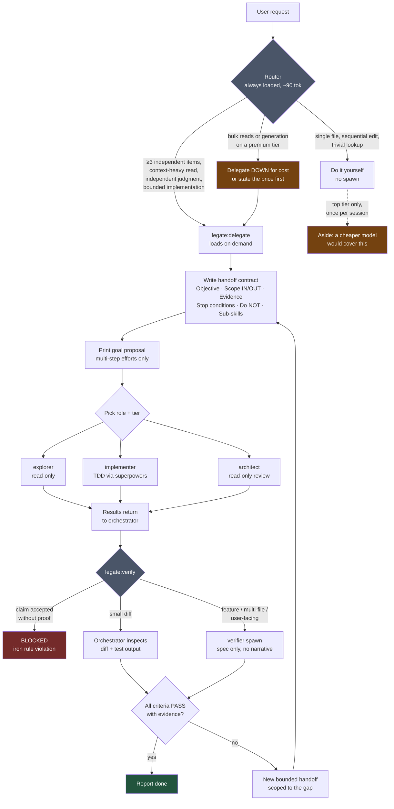
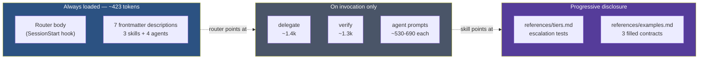
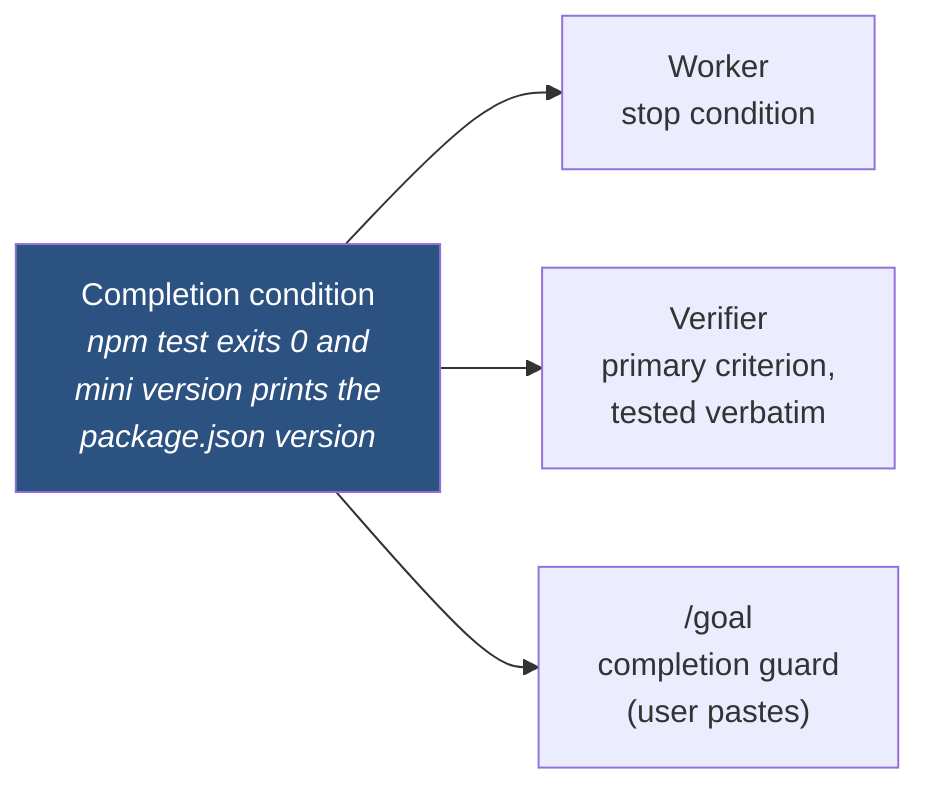

# Legate

**An orchestration layer for Claude Code that decides when to delegate, to whom, and refuses to accept "done" without evidence.**

Claude Code can spawn subagents. It has no opinion about _when_ that's worth doing, what a good handoff looks like, or whether a worker's completion claim should be believed. Legate supplies those opinions in ~423 tokens of always-on context.

It is deliberately small. Methodology — planning, TDD, debugging, code review — comes from [superpowers](https://github.com/obra/superpowers), which Legate depends on and references by name rather than restating.

> **Legate owns dispatch. Superpowers owns method.**

---

## Why this exists

Four failure modes show up constantly in agentic coding sessions:

| Failure                            | What it looks like                                                                                                   | Legate's answer                                                                                                                                      |
| ---------------------------------- | -------------------------------------------------------------------------------------------------------------------- | ---------------------------------------------------------------------------------------------------------------------------------------------------- |
| **Under-delegation**               | The orchestrator burns its own context reading 40 files serially when four parallel workers would do                 | Router fires on ≥3 independent items and other objective triggers                                                                                    |
| **Over-delegation**                | A subagent is spawned to run one `grep`; synthesis overhead exceeds the work                                         | "Delegating a grep is a bug" — an explicit NO branch with anti-rationalization table                                                                 |
| **Trusted self-reports**           | Worker says "all tests pass, task complete." It isn't, and nobody checked                                            | Iron rule: a completion claim is never evidence. Inspect the diff or spawn a fresh-context verifier                                                  |
| **Frontier tier doing grunt work** | A premium session reads 40 files into its own context, or generates 40 bespoke ones, when a cheap worker would do it | Cost gate: high-premium-token bulk (reads, generation) is delegated **down**. Scriptable edits stay inline — measured, delegating a `sed` costs more |

The last one runs both ways: workers get the cheapest model that can do the job, and the orchestrator checks its _own_ tier before working inline. What triggers a down-delegation is **premium-token volume** — bulk reads or bespoke generation — not file count; scriptable edits (a `sed` over 400 files) are near-free inline and stay there. A **small** task on the top tier also stays inline, earning a one-time aside that a cheaper model would cover it; on any normal tier small work proceeds in silence — a warning that fires constantly is one nobody reads. Every role is a **tier band** with a written escalation test, and no expensive model is chosen by accident.

A caveat the measurements earned (`evals/cost/`): these cost savings are **narrow and conditional**. They need a premium orchestrator, genuinely offloadable token volume, and delegation to actually fire — and in headless one-shot runs it often doesn't. On light or scriptable work Legate is a small tax, not a saving. Its dependable value is **verification and parallelism**, not a lower bill; treat cost savings as a bonus on heavy read/generation workloads, not a general promise.

---

## How it works


```mermaid
flowchart TD
    A[User request] --> R{Router<br/>always loaded, ~90 tok}

    R -->|"single file, sequential edit,<br/>trivial lookup"| SELF[Do it yourself<br/>no spawn]
    R -->|"≥3 independent items,<br/>context-heavy read,<br/>independent judgment,<br/>bounded implementation"| D[legate:delegate<br/>loads on demand]
    R -->|"bulk reads or generation<br/>on a premium tier"| COST[Delegate DOWN for cost<br/>or state the price first]
    SELF -.->|"top tier only,<br/>once per session"| TIP["Aside: a cheaper model<br/>would cover this"]
    COST --> D

    D --> C[Write handoff contract<br/>Objective · Scope IN/OUT · Evidence<br/>Stop conditions · Do NOT · Sub-skills]
    C --> G["Print goal proposal<br/>multi-step efforts only"]
    G --> ROLE{Pick role + tier}

    ROLE --> EX[explorer<br/>read-only]
    ROLE --> IM[implementer<br/>TDD via superpowers]
    ROLE --> AR[architect<br/>read-only review]

    EX --> RES[Results return<br/>to orchestrator]
    IM --> RES
    AR --> RES

    RES --> V{legate:verify}
    V -->|"claim accepted<br/>without proof"| STOP[BLOCKED<br/>iron rule violation]
    V -->|"small diff"| INSP[Orchestrator inspects<br/>diff + test output]
    V -->|"feature / multi-file /<br/>user-facing"| VER[verifier spawn<br/>spec only, no narrative]

    INSP --> OUT{All criteria PASS<br/>with evidence?}
    VER --> OUT
    OUT -->|yes| DONE[Report done]
    OUT -->|no| NEW[New bounded handoff<br/>scoped to the gap]
    NEW --> C

    style R fill:#4a5568,color:#fff
    style V fill:#4a5568,color:#fff
    style COST fill:#744210,color:#fff
    style TIP fill:#744210,color:#fff
    style STOP fill:#742a2a,color:#fff
    style DONE fill:#22543d,color:#fff
```

### Context loading

The whole design goal is that Legate costs almost nothing until it's needed. Claude Code loads skill _descriptions_ at startup and skill _bodies_ only on invocation — Legate leans on that hard.


```mermaid
flowchart LR
    subgraph always ["Always loaded — ~423 tokens"]
        RT["Router body<br/>(SessionStart hook)"]
        FM["7 frontmatter descriptions<br/>3 skills + 4 agents"]
    end

    subgraph lazy ["On invocation only"]
        DEL["delegate<br/>~1.4k"]
        VFY["verify<br/>~1.3k"]
        AGT["agent prompts<br/>~530-690 each"]
    end

    subgraph deeper ["Progressive disclosure"]
        TIERS["references/tiers.md<br/>escalation tests"]
        EX2["references/examples.md<br/>3 filled contracts"]
    end

    always -.->|"router points at"| lazy
    lazy -.->|"skill points at"| deeper

    style always fill:#2c5282,color:#fff
    style lazy fill:#4a5568,color:#fff
    style deeper fill:#553c9a,color:#fff
```

Verify it yourself: `claude plugin details legate`.

---

## Roles and tier bands

Every role is a band, not a fixed model. The agent frontmatter pins a default; each spawn runs that role's escalation test and passes a model override if warranted.

| Role            | Band                          | Access              | Job                                                    |
| --------------- | ----------------------------- | ------------------- | ------------------------------------------------------ |
| **explorer**    | `haiku` → `sonnet`            | read-only allowlist | search, map, summarize — conclusions, not transcripts  |
| **implementer** | `sonnet` → `opus`             | full                | one bounded task per handoff, TDD, evidence not claims |
| **architect**   | `opus` → `fable` ⚠            | no Write/Edit       | design review — verdict, ranked concerns, alternatives |
| **verifier**    | `sonnet` ← `opus` → `fable` ⚠ | no Write/Edit       | fresh-context validation, spec-only (anti-anchoring)   |

**Escalation examples.** explorer bumps to `sonnet` when the search needs inference rather than pattern-matching. implementer bumps to `opus` when the change is cross-cutting, the spec is ambiguous, the work product _is_ judgment (writing evals or rubrics rather than code against tests), or a `sonnet` attempt already failed verification — never retry the same task at the same tier.

⚠ **The `fable` step requires explicit user confirmation, every time.** It costs roughly 2× `opus` and runs minutes-long turns, so it is reserved for cases where an `opus` pass already ran and was inconclusive on an expensive-to-reverse decision. Prior approval never carries over. In-band upgrades below that never prompt — the escalation tests are the control.

Model aliases appear in exactly two places: `skills/delegate/references/tiers.md` and agent frontmatter. Nothing else in the plugin names a model, so a new tier is a two-file edit.

---

## The handoff contract

A delegated agent inherits none of your context. The spawn prompt _is_ the task. Legate requires six named sections, plus **Progress checkpoints** for any worker whose progress is worth watching — an empty one means the task isn't scoped yet:

```markdown
## Objective

One sentence, outcome-shaped. "Make X true", not "look into X".

## Scope

IN: exact paths / repos / globs the worker may touch
OUT: what is explicitly off-limits

## Expected evidence

Concrete artifacts: file:line refs, diff summary, failing-then-passing
test output, command + exit code. Never "a report that it works".

## Progress checkpoints

Append one line per phase boundary to <absolute path>, append-only:
`<HH:MM:SS> | <phase> | <one-line state>`. Required for implementers.

## Stop conditions

- Done when: <observable completion state>
- Completion condition: <one machine-checkable sentence — end state + check method>
- Max attempts: N on the same failure, then stop
- If blocked: STOP and report. Do not improvise.

## Do NOT

Commit/push, touch Scope/OUT, refactor beyond the objective,
expand into problems discovered mid-task.

## Role-specific sub-skills

REQUIRED SUB-SKILL: superpowers:test-driven-development (implementer spawns)
```

### One sentence, three consumers

The **Completion condition** line is the contract's keystone:


```mermaid
flowchart LR
    CC["Completion condition<br/><i>npm test exits 0 and<br/>mini version prints the<br/>package.json version</i>"]
    CC --> W["Worker<br/>stop condition"]
    CC --> V["Verifier<br/>primary criterion,<br/>tested verbatim"]
    CC --> G["/goal<br/>completion guard<br/>(user pastes)"]

    style CC fill:#2c5282,color:#fff
```

Before the first implementer spawn of a multi-step effort, Legate prints a ready-to-paste proposal:

```
Goal proposal (paste to arm Claude Code's completion guard):
/goal npm test exits 0 and mini version prints the package.json version
```

[`/goal`](https://code.claude.com/docs/en/goal) has no programmatic API and subagents never see it — Legate proposes, never assumes, and never blocks on it.

---

## Progress checkpoints

A transactional worker is silent until it exits, so "how far did it get?" has no answer mid-flight. Messaging the worker to ask is the wrong fix — it lands in an agent already committed to a reading of the task. Legate puts reporting in the **contract** instead: the worker appends its own phase boundaries to a file, and the orchestrator polls with `tail`.

| Role            | Checkpoints              | Phases                                                   |
| --------------- | ------------------------ | -------------------------------------------------------- |
| **implementer** | required                 | red-written / red-confirmed / green / build-clean / done |
| **explorer**    | optional — long fan-outs | scoped / searched / synthesized                          |
| **architect**   | optional — long reads    | read / assessed                                          |
| **verifier**    | never                    | one-shot and side-effect-free by design                  |

Pull, not push: no interrupt, no context cost while the worker is quiet, and the trail outlives a worker that crashes or is killed. The path must be absolute and **outside the repo and any worktree** — a status file inside the tree dirties it, so a `worktree`-isolated spawn stops auto-cleaning and the file can end up committed. One file per worker; parallel appends to a shared file interleave.

The file is the worker's own account of itself, so it is a claim, not evidence — `done` in a status file is exactly as unverified as `done` in a chat report. It is admissible for one thing: **ordering**. A `green` stamped before `red-confirmed`, or a missing `red-confirmed`, means the failing test was never seen to fail — a FAIL signal the final diff cannot give you, since it looks identical either way.

Blocked workers still surface only on poll or exit; a push channel for blockers is deliberately left to a later cut rather than guessed at.

---

## Verification

```
A SUBAGENT'S COMPLETION CLAIM IS NEVER ACCEPTED ON ITS OWN.
```

Completion requires either the orchestrator inspecting the claimed evidence directly, or a verifier spawn confirming it. Verification scales to stakes — a one-file non-user-facing diff gets read directly; a claimed-complete feature, a multi-file change, or anything user-facing gets a verifier.

The verifier receives **only** the spec, acceptance criteria, completion condition, and repo access — never the implementer's narrative, which would anchor it onto the same blind spots. It returns PASS/FAIL per criterion with an evidence pointer; a criterion with no observable proof is a FAIL.

Failures do not go back as "please fix the above." Each becomes a **new bounded handoff** scoped to exactly that gap, then gets re-verified. When no spawn is available, a documented clean-room fallback applies: re-derive checks from the spec alone and label the result "verified same-context."

---

## Worker lifecycle

A spawned worker can finish and report (transactional) or be kept alive and messaged again with its transcript intact (conversational). Legate defaults to **transactional** — the handoff contract exists so conversation is unnecessary. Resume a worker only for the _same_ task or genuinely exploratory work whose endpoint isn't knowable at spawn time; for a new task, even in the same area, spawn fresh rather than replay irrelevant history.

Two hard rules: needing to message a worker to clarify what you meant is a **spec smell**, not a workflow — fix the contract; and a **verifier is never conversational** — fresh context isolated from the producer's account is the whole point of it. Prefer carrying state externally (the completion condition, files, a written plan) and spawning fresh workers against it over accumulating it in a long-lived agent that drifts.

The published guidance backs transactional-by-default and the documented drift of long-lived contexts; the stricter claim that _verifiers_ specifically must be isolated is Legate's own inference, not established practice — applied here because the downside of being wrong is nil.

---

## Install

The repo is its own single-plugin marketplace.

```bash
claude plugin marketplace add wojciech-arch/legate
claude plugin install legate@legate --scope user
```

Legate depends on superpowers (`^6`, from the `claude-plugins-official` marketplace), which is resolved and installed automatically if missing. Restart or `/reload-plugins` to activate.

**Requires** Claude Code ≥ 2.1.196 (local-folder marketplace tag resolution). The `/goal` integration assumes ≥ 2.1.139; without it the goal proposal is simply inert text.

### Development

```bash
claude plugin marketplace add /path/to/legate
claude plugin install legate@legate --scope user
```

Installs are snapshot copies, not live links. After editing the source, re-sync:

```bash
claude plugin uninstall legate && claude plugin install legate@legate --scope user
```

`/reload-plugins` refreshes skills and agents but does **not** re-fire the SessionStart hook — start a fresh session to pick up router changes. For a GitHub-installed copy, run `claude plugin marketplace update legate` before the reinstall.

---

## Try it

In a fresh session:

```
Work on the fixture at evals/fixtures/mini-cli (copy it to /tmp first).
Map the project, then add a `version` command printing the version from
package.json. Delegate the implementation and verify it independently
before telling me it's done.
```

Expect: router announces itself → mapping done inline (3 files is below the delegation bar) → goal proposal printed → implementer spawn with a full contract → verifier spawn fed spec-only → per-criterion PASS/FAIL with command output.

---

## Repository layout

```
legate/
├── skills/
│   ├── orchestrating/SKILL.md      # router — the only always-injected body
│   ├── delegate/
│   │   ├── SKILL.md                # handoff contract template
│   │   └── references/
│   │       ├── tiers.md            # escalation tests + the only prose model names
│   │       └── examples.md         # three complete filled-in contracts
│   └── verify/SKILL.md             # verification protocol
├── agents/                         # explorer, implementer, architect, verifier
├── hooks/                          # SessionStart injection (zero-dependency bash)
└── evals/                          # 7 behavioral cases + grader + fixture
```

## Evals

`evals/` holds seven behavioral cases — fan-out routing, correct non-delegation, the implement→verify pipeline, rejection of an unevidenced completion claim, the cost gate on judgment-free bulk work, tier fit on small tasks (which grades the _absence_ of nagging as strictly as its presence), and progress checkpoints written into the contract rather than asked for mid-flight — plus a grader rubric and a small fixture CLI. The layout targets Claude Code's `claude plugin eval` harness (`evals/**/prompt.md` + `graders/*.md`), which is currently early-access gated; `evals/README.md` documents the manual runner protocol used in the meantime.

The first round's scorecard is in `evals/results/`. Honest summary: the discipline half passed cleanly (correct non-delegation, refusal of a false completion claim, TDD red→green with byte-exact evidence). The delegation half was **blocked, not passed** — the runner subagents had no Agent tool, so real handoffs and fresh-context verifier spawns could not fire. A harness that drives cases through `claude -p` subprocesses is the fix.

`evals/cost/` is that harness applied to the money question: real `claude -p` A/B runs (Legate on vs off), scored on the CLI's own per-model `total_cost_usd`. The results are blunt. Measured on `opus`, the cost gate's delegation did **not** fire in headless one-shot mode, so Legate ran **0–11% more expensive** across three tasks (a trivial lookup, a 20-file version bump, a 25-file survey). Measured _directly_, the delegation pattern it is supposed to produce — haiku explorers reading the files, `opus` synthesizing — is **32% cheaper** on the read-heavy survey (**48% projected on `fable`**). The savings are real but gated on delegation actually triggering; `evals/cost/results/` has both rounds (Opus 4.8 and Opus 5) and `cost.mjs` reprices them for any tier.

### Measured numbers (2026-07-26, Opus 5)

All figures are the CLI's own `total_cost_usd` from real `claude -p` sessions, CEO on `opus` (= `claude-opus-5`), `haiku` legs on `claude-haiku-4-5`, against small fixtures — **read the percentage, not the dollars.**

**Legate as it auto-triggers (headless one-shot):**

| Task                        | Baseline (no Legate) | Legate on | Δ          | Delegated?                     |
| --------------------------- | -------------------- | --------- | ---------- | ------------------------------ |
| trivial-lookup (1 file)     | $0.3025              | $0.3194   | **+5.6%**  | no — correct (below threshold) |
| bulk-edit (20 files)        | $0.4672              | $0.5201   | **+11.3%** | no — correct (`sed`-able)      |
| wide-read-survey (25 files) | $1.0193              | $1.0199   | **+0.06%** | no — **missed**                |

Auto-triggered, Legate never delegated: every arm's `modelUsage` holds exactly one model. Two of the three non-delegations were the right call; the survey was a genuine miss. The tax ranges from negligible (read-heavy) to material (**+11.3%** on scriptable bulk, where routing deliberation buys nothing).

**The delegation pattern, measured directly (survey, `opus`):**

| Strategy                                                | Cost        |
| ------------------------------------------------------- | ----------- |
| Baseline — `opus` does the whole survey                 | $1.0193     |
| Legate pattern — 3 `haiku` explorers + `opus` synthesis | **$0.6912** |
| **Saving**                                              | **−32.2%**  |

Tokens move the opposite way — 6,507 → 9,335 (**+2,828 tokens for −$0.33**), which is the whole thesis in one line: Legate trades tokens for price tier.

**Projected to a `fable` CEO** (re-priced from the same measured tokens; `fable` is 2× `opus`): baseline $2.0385 → delegation pattern $1.0664 = **−47.7%**.

**Opus 4.8 → Opus 5.** Pricing is identical ($5/$25), so every shift below is behavioural. Delegation's payoff **improved** (−28.1% → −32.2%) because Opus 5 grinds harder on open-ended reads — the survey baseline went from 9 turns to 20, inflating exactly the cost delegation removes. The read-heavy tax fell from +13.7% to +0.06%, though for an unflattering reason: the baseline rose to meet the Legate arm rather than the Legate arm improving. The scriptable-bulk tax got **worse** (+4.2% → +11.3%). And delegation failed to auto-fire on _both_ generations — two independent models behaving identically is evidence this is a router-design property, not a model quirk. Full comparison in `evals/cost/results/2026-07-26-opus5/`.

The takeaway in one line: on the _same_ task, the cost is $0.645 if it delegates and $1.020 if it doesn't — a **37% swing that is entirely "did delegation fire."** Legate's economics are favorable on read-heavy work; its bottleneck is triggering, not the trade.

## Design invariants

These are enforced at review, not by tooling — they're what keeps the plugin small:

- **≤10 always-loaded descriptions.** The standing context budget.
- **Router body ≤2 KB.** A dispatcher with zero domain or methodology content. (Raised from 1.5 KB once for the cost gate — a narrow branch that helps only on heavy read/generation workloads; see `evals/cost/`.)
- **Model names in exactly two places.** `tiers.md` and agent frontmatter.
- **No enforcement hooks.** SessionStart injection only; nothing blocks tool calls.
- **No `commands/` directory.** Skills and agents (commands are deprecated upstream).
- **Prose contracts, never duplication.** Superpowers is referenced by name, never copied.

## Prior art

Legate borrows deliberately: the tiny-always-loaded-router-plus-lazy-skills shape and anti-rationalization tables from [superpowers](https://github.com/obra/superpowers); the self-contained handoff (objective, scope, expected evidence, stop conditions) from BuilderIO's `efficient-fable`; per-agent tool scoping — review roles denied Write/Edit — from production workflow plugins; and the never-trust-a-self-report rule, which independent projects keep converging on.

## License

MIT
